# AZURE LOAD BALANCER PROJECT

## 📌 Project Overview
This project demonstrates the implementation of Azure Public and Private Load Balancers using a secure two-tier architecture in Microsoft Azure.  
The Web layer uses Nginx, and the Application layer uses Tomcat, protected using Network Security Groups and Private Load Balancer.

---

## 🧱 Architecture Components
- Resource Group  
- Virtual Network  
- Subnets (Web & App)  
- Network Security Groups  
- Public Load Balancer  
- Private Load Balancer  
- Web VM (Nginx)  
- App VM (Tomcat)  

---

## 📂 Resource Group
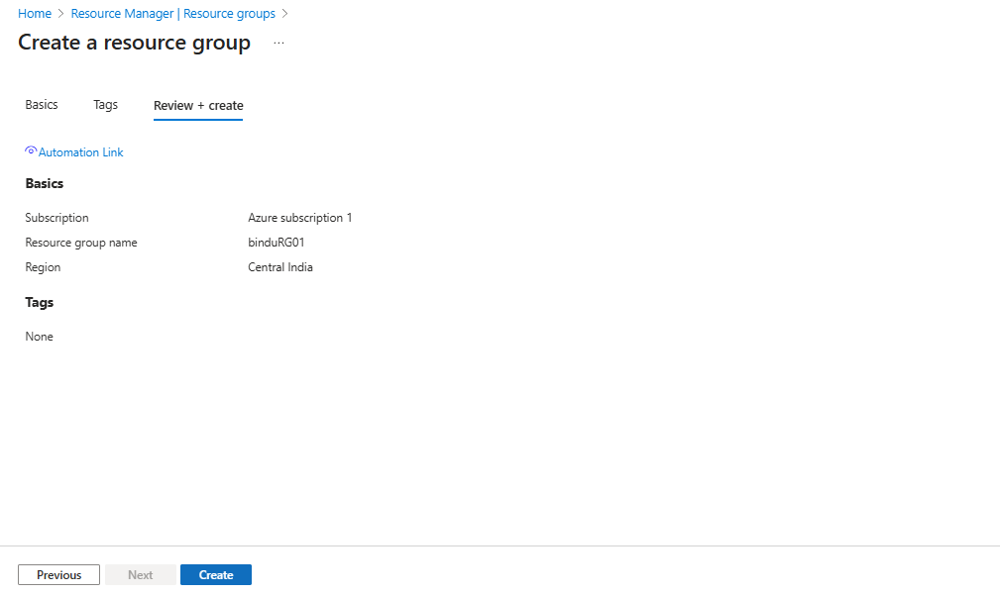

---

## 🌐 Virtual Network
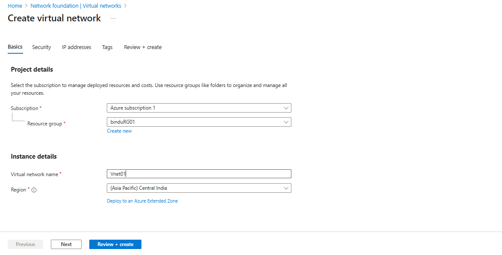

---

## 🧩 Subnets

---

## 🖥️ App Virtual Machine (Tomcat)
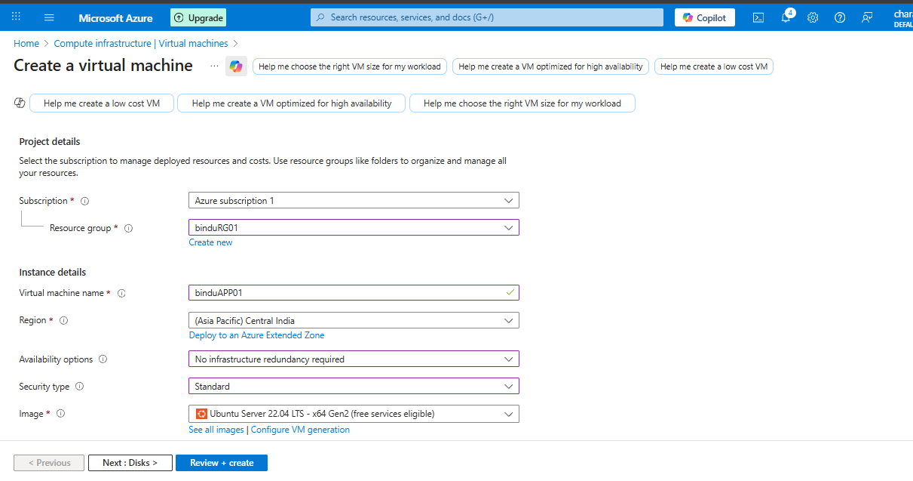

### 🔒 App NSG Configuration

### ⚙️ Tomcat Installation
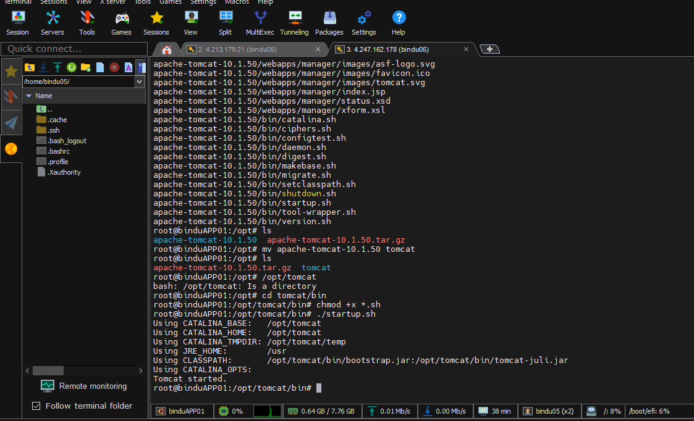

---

## 🖥️ Web Virtual Machine (Nginx)
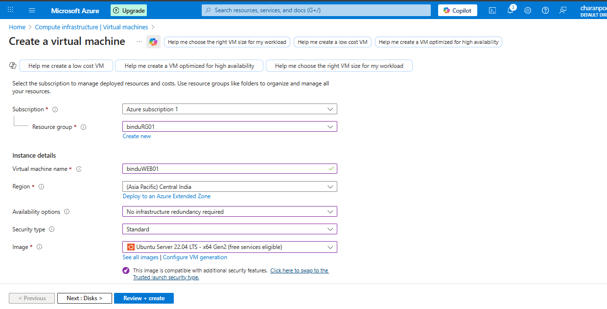

### 🔑 Nginx Commands

### 🌐 Nginx Homepage
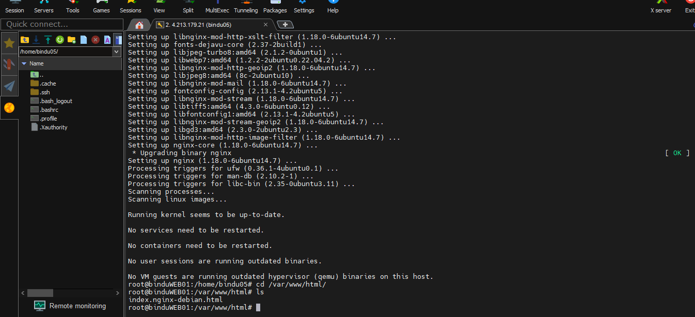

---

## 🌍 Public Load Balancer
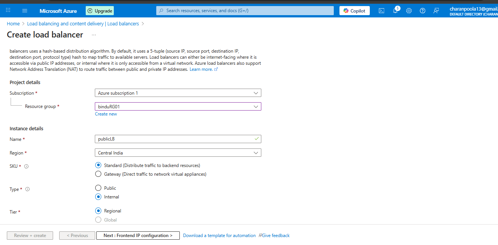

### Frontend IP
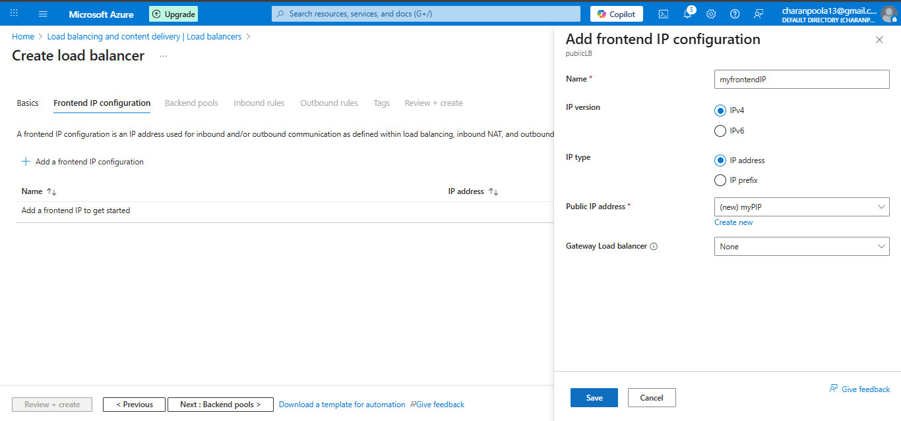

### Backend Pool
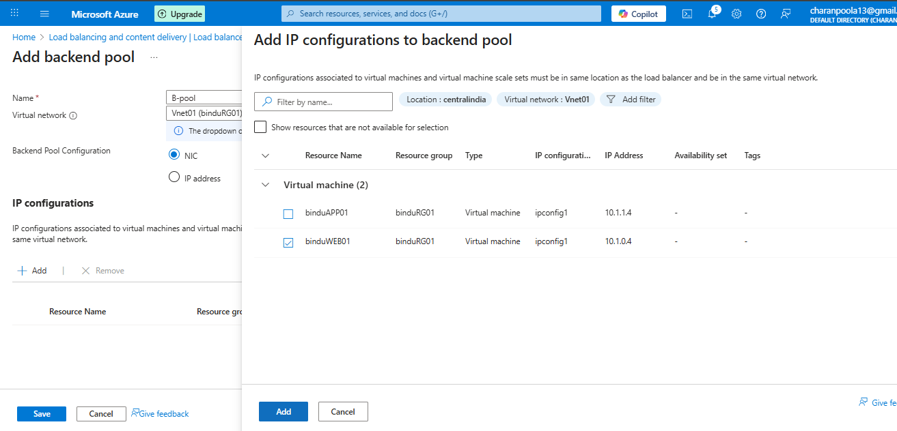

### Health Probe
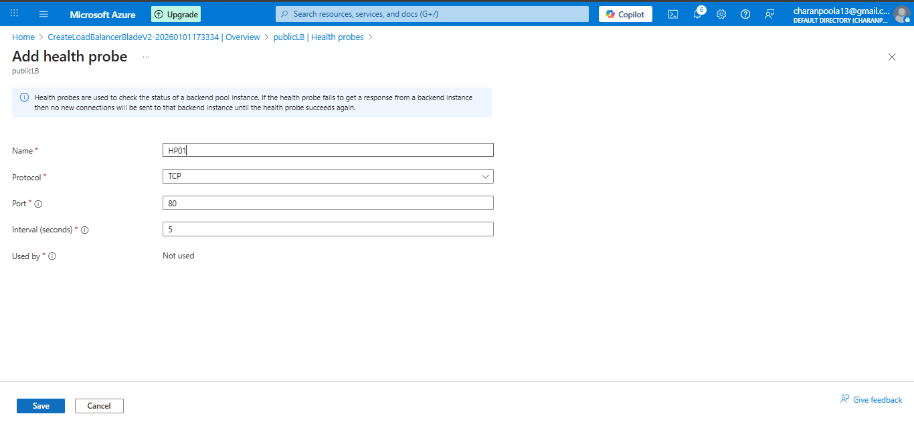

### Load Balancing Rule
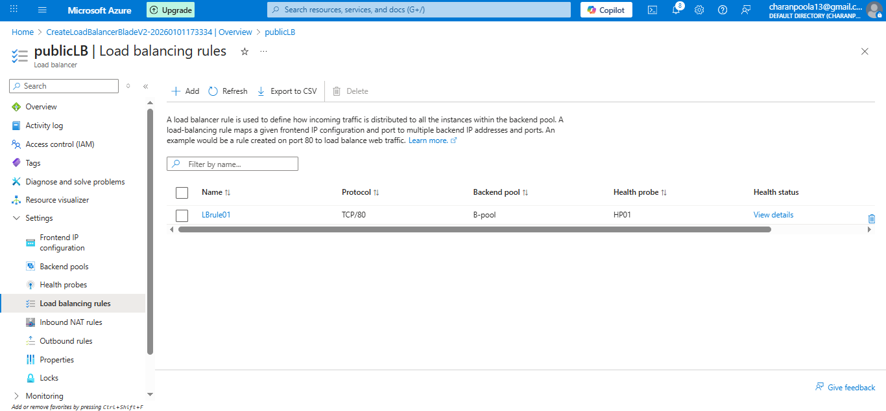

---

## 🔒 Private Load Balancer
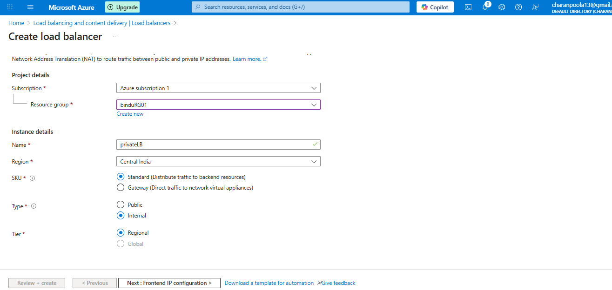

### Frontend IP
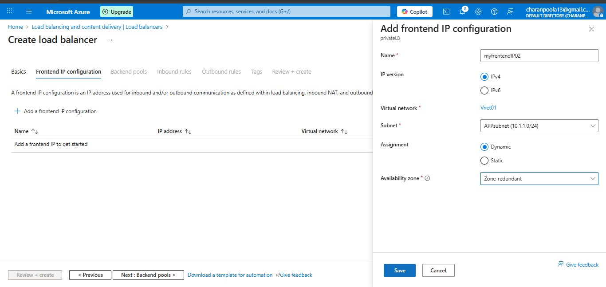

### Backend Pool
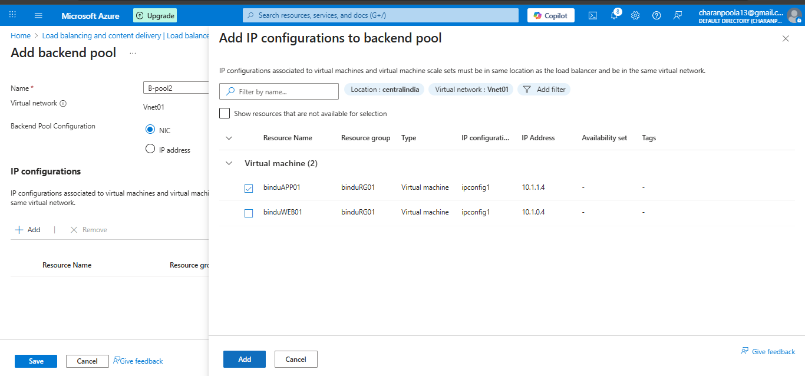

### Health Probe
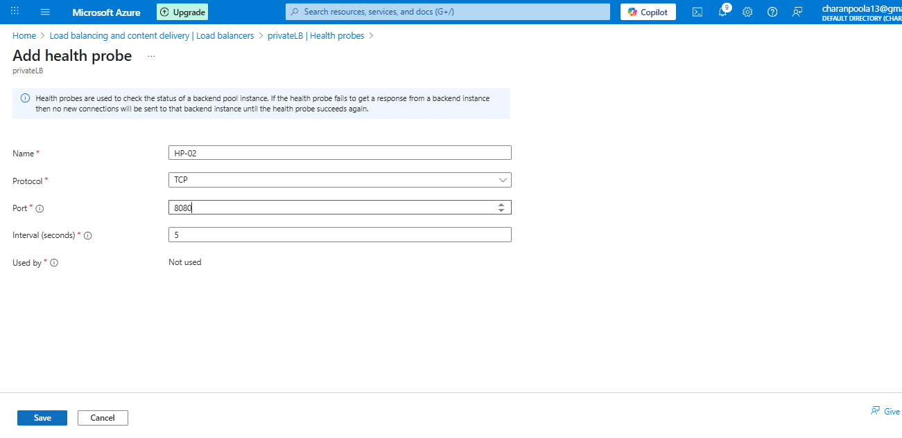

### Load Balancing Rule
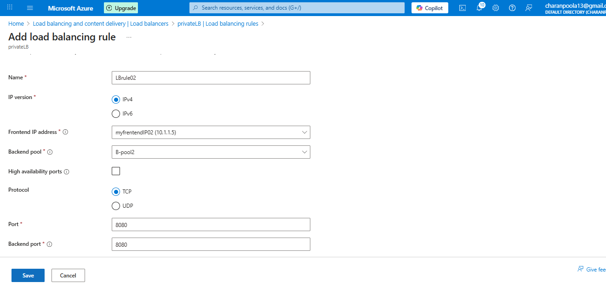

---

## ⚖️ Load Balancers Overview
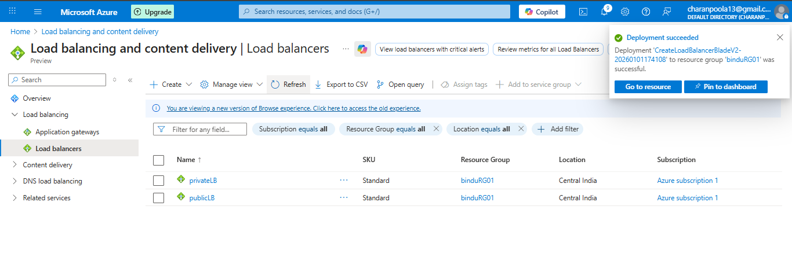

---

## 🌐 Web IP Verification
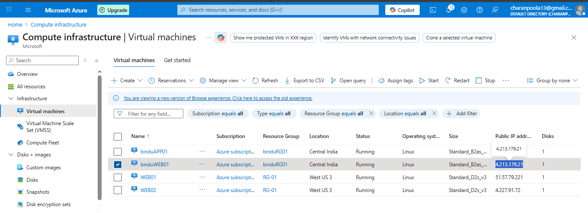

---

## 🔌 Connectivity Test (Final Validation)
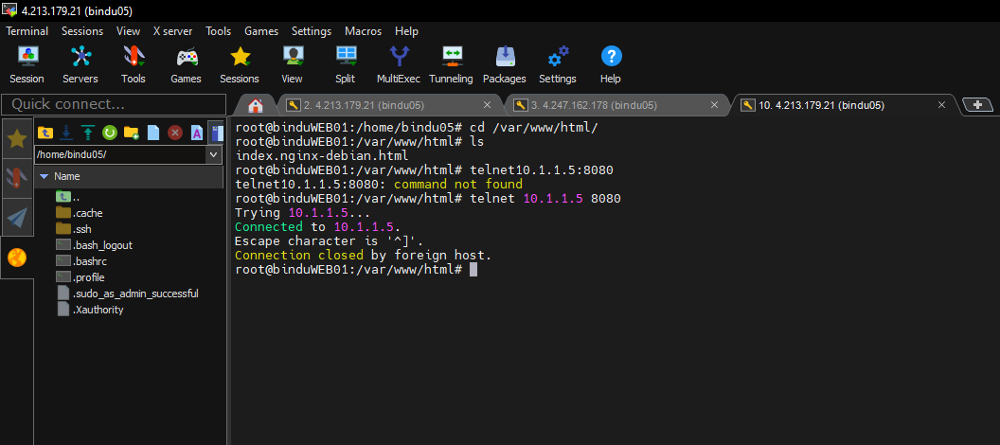

---

## ✅ Conclusion
This project demonstrates hands-on experience in:
- Azure Virtual Networks & Subnets  
- Network Security Groups (NSG)  
- Public and Private Load Balancers  
- Web and Application VM deployment  
- Secure internal application connectivity  

This implementation follows real-time industry best practices for security, scalability, and high availability.

Created by: Bindu Rachamalla  
Role: Azure / Cloud Fresher
